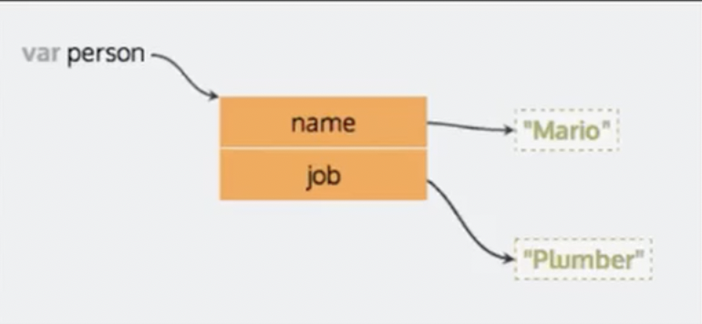

# Objetos

Un objeto es una coleccion de propiedades, y una propiedad es una asociacion entre un nombre (o clave `KeyValue`) y un valor.



Nota: JavaScript esta diseñado sobre un paradigma simple basado en objetos

En la programacion siempre se intenta `resolver` problemas de la vida real y debido a esto necesitamo representar `cosas` de la vida real en programacion.

Un ejemplo es como representaria a una persona en programacion, la idea de los objetos es modelar mejor el mundo real.

```javascript
// Objeto literal

var objeto = {
	propiedad: Valor1;
	...
	propiedad: ValorN;
}

// ejemplos de objetos

var toni = {
	nombre: 'Toni'
	apellido: 'Tralice',
	edad: 33,
	saludar: function() {
		console.log('hola', 'Toni');
	},
	hobbies: ['escalar', 'fotografia', 'dar clase'],
}

var boris = {
	nombre: 'boris',
	edad: 33,
	cursando: true,
}

```

## Propiedades

### Acceder a valores

Para acceder an un valor del objeto usamos el `Key:Value` con este podemos extrer el valor que se guaro en el objeto con su `Key:Value`

Los `Key;Values` son propiedades su indetificador se escriben como `strings`

Ya teniendo el `Key:Value`, podemos extraer el valor con estas dos tecnicas:

1. DOT.NOTATION (no permite crear un propiedad)

```javascript
// ejemplos de objetos

var toni = {
	nombre: 'Toni',
	apellido: 'Tralice',
	edad: 33,
	saludar: function() {
		console.log('hola', 'Toni');
	},
	hobbies: ['escalar', 'fotografia', 'dar clase'],
}

// para extraer el apellido lo realizamos de la siguiente forma

toni.apellido

> toni.apellido
'Tralice'
>

```

2. BRACKET NOTATION `[]`  (si permite crear un propiedad)

```javascript
var toni = {
	nombre: 'Toni',
	apellido: 'Tralice',
	edad: 33,
	saludar: function() {
		console.log('hola', 'Toni');
	},
	hobbies: ['escalar', 'fotografia', 'dar clase'],
}

// para extraer el apellido lo realizamos de la siguiente forma

toni['apellido']

> toni['apellido']
'Tralice'
>

// Otra forma de extraer el apellido

variable = 'apellido'

toni[variable]

> toni[variable]
'Tralice'
>
```

### Asignar a valores

Un objeto podemos ir adicionandole valores creando nuevos `Key:Values ` como ejemplo:

```javascript
// En esta caso vamos a usar el keyword const que nos permite crear un objeto que su keyvalues 
// no pueden se modificados (pisados por otro valor)
const nuevoUsuario = {
    esNuevo: true
}

// para adicionar un nuevo Key:Values lo realizamos de la siguiente forma:

nuevoUsuario.username = 'otro.nombre.de.usuario';
nuevoUsuario['password'] = '12345';

// Otra forma de adicionar un nuevo Key:Values

const loveJSString = 'lovesJavascript';
nuevoUsuario[loveJSString] = true;

> nuevoUsuario
{
  esNuevo: true,
  username: 'otro.nombre.de.usuario',
  password: '12345',
  lovesJavascript: true
}
>

```

### Eliminando propiedades

Para eliminar una propiedad usamor el keyword `delete`

```javascript
const nuevoObjeto = {
    eliminarEstaPropiedad: true
};

delete nuevoObjeto.eliminarEstaPropiedad;

> nuevoObjeto
{}
>

```

### Otras cualidades de los objetos

Los objetos tienen cualidades que nos permiten hacer aoperaciones con el `Key:Values` ejemplo

```javascript
var toni = {
	nombre: 'Toni',
	apellido: 'Tralice',
	edad: 33,
	saludar: function() {
		console.log('hola', 'Toni');
	},
	hobbies: ['escalar', 'fotografia', 'dar clase'],
}

* Hacer operaciones con `strings`

> 'Hola!, ' + toni.nombre;
'Hola!, Toni'
>

* Hacer operaciones con `numbers`

> toni.edad  * 2;
66
>

* Ejecutar funciones `function`

> toni.saludar();
hola Toni
undefined
>

* Extraer valores de un arreglo `array`

> toni.hobbies[1];
'fotografia'
>
```

### Keyword THIS

Con `this` yo tengo una forma de referenciar la propiedad  de un objeto en un metodo contenido en el mismo objeto

Nota: `Una funcion anidada en un objeto se le llama metodo`

Un ejemplo de como usar `this` es el siguiente:

```javascript
var persona = {
	nombre: 'Jimmy',
	saludar: function() {
		console.log('Hola, ' + this.nombre);
	}
};

> persona.saludar()
Hola, Jimmy
undefined
>
```

Cuando se usa `this` se evita la necesidad de tener que hacer nuevamente la funcion, este es un ejemplo

```javascript
// en este caso la funcion al estar creada con this no necesitamos crear una funcion para cada uno
// de los obejtos

function saludar(){
	console.log('Hola, ' + this.nombre);
}

var manu = {
	nombre: 'manu',
	saludar: saludar
}

> manu.saludar()
Hola, manu
undefined
>

var martin = {
	nombre: 'martin',
	saludar: saludar
}

> martin.saludar()
Hola, martin
undefined
>
```

Nota: **El codigo simpre debe ser `escalable` y se pueda `compartir`, ejemplo function se pueda compartir con todos los objetos que tenga las mismas caracteristicas de `Key:Values`**

***Otras curiosidades de JS***

Cuando creas un obejto con un keyword `this` y el objeto no tiene ningun `Key:Values` con el nombre que se esta ejecutando el obejto busca en la variables globales ejemplo:

```javascript
// Objeto global
{
var nombre = 'No es magia';
var array = [1,2,3];
}

function saludar(){
	console.log('Hola, ' + this.nombre);
}

> saludar()
Hola, No es magia
undefined
>
```

Hay curiosidades como cuando creas una funcion en la varible global en el objeto puedes invocar la funcion de las dos siguientes formas:

```javascript
// Si creamos una funcion 

function getEdad(){
	return this.edad * 2;
}

// En este caso getEdad esta llamando la funcion globlal que he creado con el nombre de getEdad
var objeto1 = {
	edad: 32,
	getEdad: getEdad
}

// En este caso getEdad esta llamando la funcion globlal que he creado con el nombre de getEdad
var objeto2 = {
	edad: 14,
	getEdad
}
```

## Métodos

En los objetos, los valores se pueden establecer en funciones. Las funciones guardadas en un objeto se denominan métodos, ejemplo:

```javascript
const nuevoObjeto = {
    decirHola: function() {
        console.log('Hola a todo el mundo!');
    }
}

> nuevoObjeto.decirHola();
Hola a todo el mundo!
undefined
>
```
***Para hacer el codigo escalable puede usar el KeyWord `this` en el metodo ejemplo:***

```javascript
var persona = {
	nombre: 'Jimmy',
	saludar: function() {
		console.log('Hola, ' + this.nombre);
	}
};

> persona.saludar()
Hola, Jimmy
undefined
>
```

## Bucle for…in

A veces necesitamos iterar sobre cada `Key:Value` y en este caso no podemos usar la misma tecnica que usamos para iterar en arreglos `array`, debido a que las matricies su indice esta compuesto de una secuencia numerica y en este caso no tenemos forma de indetificar los indices del objeto, para este caso usamos el for de la siguiente forma:

1. en el for definimos una palabra ejemplo: `clave`
2. la palabra de ir seguida del keyword `in`
3. seguidamente del nombre del objeto ejemplo: `usuario`

```javascript
const usuario = {
    username: 'juan.perez',
    password: 'loremipsumpwd123',
    lovesJavascript: true,
    favoriteNumber: 42
};

for (let clave in usuario){
    console.log(clave);
    console.log(usuario[clave]);
}
username
juan.perez
password
loremipsumpwd123
lovesJavascript
true
favoriteNumber
42
undefined
>
```

## Notación de puntos vs notación de corchetes

Notacion de puntos `DOT.NOTATION`, tiene la ventaja que es mas facil y rapido de escribir una regla de consulta en el objeto, ejemplo:

1. DOT.NOTATION 

```javascript
// ejemplos de objetos

var toni = {
	nombre: 'Toni',
	apellido: 'Tralice',
	edad: 33,
	saludar: function() {
		console.log('hola', 'Toni');
	},
	hobbies: ['escalar', 'fotografia', 'dar clase'],
}

// para extraer el apellido lo realizamos de la siguiente forma

toni.apellido

> toni.apellido
'Tralice'
>

```
**Sus desventajas es que el `Key:Values` debe ser el nombre exacto con el que se creo el `Key:Values`**

Notación de corchetes `BRACKET NOTATION`, su estrutura de codigo es mas organizada para entender como se extrae el `KeyValue` y ademeas es el unico metodo que nos permite sacar valores cuando un `KeyValues` es un arreglo `array`

Asi mismo, `BRACKET NOTATION` es mas facil recorrer las propiedades del objeto y intercalar entre ellas

2. BRACKET NOTATION `[]`

```javascript
var toni = {
	nombre: 'Toni',
	apellido: 'Tralice',
	edad: 33,
	saludar: function() {
		console.log('hola', 'Toni');
	},
	hobbies: ['escalar', 'fotografia', 'dar clase'],
}

// para extraer el apellido lo realizamos de la siguiente forma

toni['apellido']

> toni['apellido']
'Tralice'
>

// Otra forma de extraer el apellido

variable = 'apellido'

toni[variable]

> toni[variable]
'Tralice'
>
```
