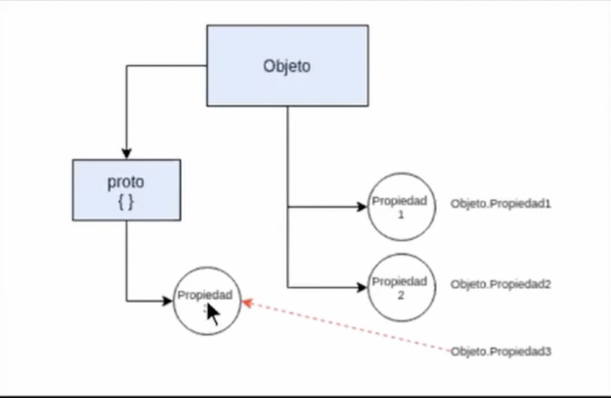

# Prototype



Cada objeto que creamos en JavaScript tiene sus propias propiedades, pero a su vez debe de tener un `prototype` (que puede ser cualquier otro).

Cuando yo creo un `objeto` y busco una `propiedad` que no esta en el objeto el la busca en el `prototype` si esta la usa si no esta bota un error

**Javascript es uin diseno basado en prototipo, todos los objetos de javascript tienen una referencia a otro objeto que es llamado su prototipo**

## Como hacemos para crear un `prototype`

1. Una de las razaones para crear un `prototype` es que necesitamos reducir consumo de recursos de memoria, esto se debe que la creación de funciones consumen memoria y cada vez que creamos un nuevo objeto de clase con métodos, estamos recreando esos métodos en la memoria.
2. La herencia basada en prototipo, consiste si la propiedad esta en el objeto la usa si no esta la busca en el prototype sin no esta la buscar en el prototype del prototype

### Una forma de crear un prototype es:
1. Crear en el `function constructor` todas las propiedades que quiere uno en el objeto
2. Crear en el `prototype` todos los metodos que queremos usar en los objetos (es importante que se cree el metodo usando la variable `this`)
3. Crear el objeto con la variable `new` invocando el `function constructor`

```javascript
// function constrcutor
// todas las propiedades que quiere uno el el objeto va en el constructor
function Persona(nombre, apelllido){
	this.nombre = nombre || 'Juan';
	this.apelllido = apelllido || 'Perez';
}
// prototype
// todo los metodos iran en el prototype (siempre se debe usar la variable this)
Persona.prototype.getNombre = function() {
	return this.nombre + ' ' + this.apelllido;
}

var toni = new Persona('Toni', 'Tralice');
var tincho = new Persona('Martin', 'Bochardt');
var emi = new Persona('Emi', 'Chequer');

toni.getNombre()
```

### Otro metodo para crear un prototype es `OBJECT.CREATE Y PURE PROTOTYPAL INHERITANCE`

Object.create recibe un objeto como parametro y crea un nuevo objeto cuyo prototipo es el primero que pasamos. Por lo tanto, vamos a poder acceder a todas las propiedades y metodos del objeto base en los nuevos objetos creados.

Nota: este metodo es lo mas parecido al comportamiento del lenguaje de JavaScript (pero se dificulta comprender, como fueron creados los objetos y metodos asociados a el)

```javascript
var person {
	nombre = 'Defecto',
	apellido = 'Defecto'
}

var toni = Object.create(person); //le paso el objeto que creamos
console.log(toni) // es un objeto
console.log(toni.__proto__) // es el objeto person que creamos al principio
```

### El metodo ES6 Y CLASES (CLASS)

Este metodo nace en un convenio definido por la organizacion ECMA Script en el que el ES6 busca una  clara orientación a clases y herencia, la forma de redactar una `class` es de la siguiente forma:
```javascript 
class Persona{
	constructor (nombre, apellido){
		this.nombre = nombre;
		this.apellido = apellido;
	}
	saludar(){
		console.log('Hola!' + this.nombre);
	}
}

var tony = new Persona('Toni', 'Tralice');
toni.saludar()
```

### Otro metodo de crear prototype es el metodo orientado a objetos 

```javascript
class Empleado extends Persona {
	constructor (nombre, apellido, empleo, sueldo){
		super(nombre, apellido);
		this.empleo = empleo;
		this.sueldo = sueldo;
	}
}

var toni = new Empleado('Toni', 'Tralice', 'Profesor', 100);
toni.saludar()
```

# Function constructors y NEW

Un function constructor nos permite crear objetos que sean parecidos entre ellos para crea un functio constructor debemos seguir un acuerdo en el convenio de programador en el que el nombre e la function en el que la primera letar debe ser en mayuscula.

Ya creada la `function constructor` con las propiedas que queremos en el objeto, para crear el objeto con estas propiedades usamos `new` para invocar el `function constructor` y crear el nuevo objeto.

```javascript
// function constructor

function Persona() {
	this.firstname = 'Juan';
	this.lastname = 'Perez';
}

// keyword new
var juan = new Persona();
console.log(juan)
```
Se puede decir que `function constructor` es una fabrica de objetos, todas las `function constructor` debe emperzar con una letra mayuscula, tenemos los siguientes keyword que usamos en function constructor.

- **keyword this**
    Es necesario usar el `this` para poder reusar el codigo en todo los objetos por eso su importancia de usarlo al crear un `function constructor`
- **keyword new**
    El keyword `new` nos permite crear el objeto con toda las propiedades de que tiene el `function constructor`


### Behind te scence `new`

Lo que hace detras de escena la funcion `new` es lo siguiente:

1. Crea un objeto vacio.
2. Crea un funcion y con los datos asociados al objeto.
3. La funcion `bind` lo que hacer es asociar al objeto con los datos de de la funcion.
4. Retorna el objeto.

```javascript
// objeto
var objeto = {};

// function
Car('audi', 1500, 'verde').bind(objeto) // bind, de la function Car tiene que ser objeto

return ojbeto;
```